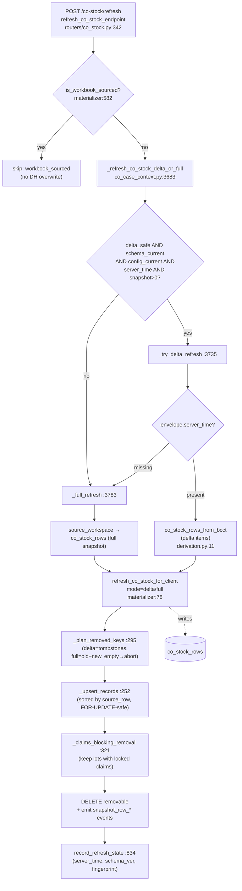
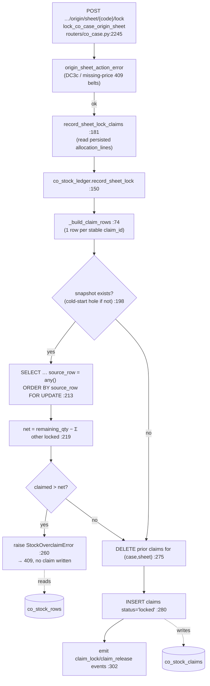

# CO-stock / refresh / lock / claim subsystem — reference map

**Scope:** how "tồn CO" is materialized, refreshed from Data Hub, and drawn down by
CO cases. This is the highest-risk area (delta-vs-full drift, cold-start over-claim,
snapshot wipe, claims contention). Every claim below is cited `file:line` against the
code at the time of writing (branch `agent/doc-co-stock-subsystem`). Where the code
was not directly read, the statement is marked **UNVERIFIED**.

Primary modules:
- `app/co_stock_materializer.py` — snapshot table read/write, delta-vs-full plan, refresh state.
- `app/co_stock_ledger.py` — cross-case consumption claims (lock/release/overlay).
- `app/web/co_case_context.py` — refresh dispatch, read-time overlay, allocation pool.
- `app/co_stock_derivation.py` — `co_stock_rows_from_bcct` (BCCT → derived rows, `source_row`).
- `app/routers/co_stock.py` — refresh + workbook-import endpoints.
- `app/routers/co_case.py` — sheet lock/release (Chốt/Gỡ), overclaim handling.

Settled model: `.ai/features/2026-06-14-cs3-costock-three-sources/brief.md` (CS3),
`.ai/BACKLOG.md` (D1 §"Tồn CO / Data Hub refresh", D2/Fix F), `.ai/GLOSSARY.md`
(lot-key grain, `material_code` overload).

---

## 1. The data model

Four Postgres tables under schema `co`. All are per-client (`client_id text`); there is
no cross-client sharing.

### `co_stock_rows` — the materialized tồn snapshot
Migration `db/migrations/001_source_indexes.sql:89-109`.

| Column | Meaning |
|---|---|
| `client_id`, `source_row` | **Primary key** (`:102`). `source_row` = the lot's stable id. |
| `transaction_key` | BCCT transaction key the row derived from (blank for workbook/aggregate). |
| `import_declaration_no`, `line_no`, `customs_item_code` | The **lot key** `(decl, line, customs)` — see below. |
| `declaration_type` | e.g. import-declaration type preset. |
| `allocation_code` | CO-**derived** bridge code (concept 6, mutable) — NOT a key. |
| `eligibility_status` | `inactive` filters the lot out. |
| `remaining_qty` (text) | **Folded remaining** = `opening_qty − baseline_used_qty` (off-app draw-down already subtracted; live claims are NOT). See `STATUS_FILTERS` comment `co_stock_materializer.py:501-503`. |
| `payload` (jsonb) | Full derived row: `opening_qty`, `baseline_used_qty`, `unit_value`, `hs_code`, `registration_date`, `allocation_code_status`, `co_stock_source`, `material_description`, etc. |
| `indexed_at` | Set to `now()` on every UPSERT (`:275`) — drives the snapshot cache marker. |

Indexes: `(client_id, decl, line, customs)` lookup `:105-106`; `(client_id, allocation_code, eligibility_status)` `:108-109`.

**`source_row` construction** (`app/co_stock_derivation.py`):
- Per-line lot: `source_row = import_row_id(transaction_key) = "import-row-" + sha1(transaction_key)[:16]` (`:29`, `:247`).
- Aggregate lot (`lot_policy = aggregate_by_declaration_and_allocation_code`):
  `source_row = ",".join(source_line_ids)` — a **comma-joined set** of per-line ids (`:186`).
  This is why delta/tombstones cannot address aggregate lots (see §3).

### `co_stock_claims` — cross-case consumption ledger
Migration `db/migrations/007_co_stock_ledger.sql:6-31`; lot-key columns `010:7-13`; FK `016`.

| Column | Meaning |
|---|---|
| `claim_id` | **Primary key**. Stable hash `sha256(case_id|sheet_product_code|source_row|material_key)[:16]` (`co_stock_ledger.py:54-71`). `material_key` is the BOM `material_code`, falling back to `#index` — reordering the BOM does not churn the id. |
| `client_id`, `case_id`, `sheet_product_code` | Owner of the claim. |
| `source_row` | The lot claimed — joins to `co_stock_rows.source_row`. |
| `material_code`, `material_index` | BOM leaf identity (for the claim_id and audit). |
| `claimed_qty` numeric(20,6) | Qty this sheet consumes from the lot. |
| `status` | `locked` \| `released` (check constraint `:15`). Only `locked` counts against tồn. |
| `declaration_no`, `line_no`, `customs_code` | Lot key copied 1:1 for audit events (`010`). `customs_code` == source lot's `customs_item_code` (GLOSSARY concept 1). |
| `locked_at`, `released_at` | Lifecycle timestamps. |

FK `co_stock_claims (client_id, case_id) → co_cases (client_id, case_id) ON DELETE CASCADE`
(`016:21-25`) — defense in depth so a direct case delete cannot orphan claims.
Indexes: per-lot `(client_id, source_row, status)` `007:22-23`; per-case `(client_id, case_id)` `:26-27`; per-sheet `:30-31`; lot-key `010:12-13`.

### `co_stock_refresh_state` — one row per client, refresh bookkeeping
Migration `011`, extended by `014`, `020`, `021`.

| Column | Meaning |
|---|---|
| `client_id` | Primary key (`011:10`). |
| `snapshot_row_count` | Rows persisted at last refresh. |
| `bcct_row_count_at_refresh` | Total published BCCT rows at refresh — the staleness comparator. **Note:** delta path writes the FULL source count here, not the delta size (D1, §3). |
| `bcct_indexed_at_at_refresh` | Optional DH indexed-at marker. |
| `last_bcct_server_time` (`014`) | Data Hub high-water mark; the `since=` cursor for the next delta. |
| `derivation_schema_version` (`020`, default 0) | Stamp of the CO derivation payload shape; forces full on mismatch. |
| `co_config_fingerprint` (`021`, default '') | Hash of CO-owned config sections; forces full on mismatch. |
| `refreshed_at` | Wall-clock of last refresh (drives the 30s calc freshness gate). |

Write via `record_refresh_state` (`co_stock_materializer.py:834-874`); `last_bcct_server_time`
is preserved when the new value is `''` (`:857-859`). Read via `read_refresh_state` (`:877`).

### `co_stock_events` — per-lot audit log
Migration `009_co_stock_events.sql`. Keyed by lot tuple `(client_id, decl, line, customs, recorded_at)`.
Event types: `adjustment_import_insert/update/void`, `claim_lock`, `claim_release` (`009` check),
plus `snapshot_row_added/updated/removed` (added by `013`). Audit-only — event write
failures never abort a refresh or a lock (`co_stock_materializer.py:386-387`,
`co_stock_ledger.py:302`).

**Removed:** `co_stock_adjustments` (migration `008`) was dropped by `017`. The static
off-app baseline is no longer folded via an overlay table; it is baked directly into
`co_stock_rows.baseline_used_qty` at import time.

### The invariant

```
free tồn (per lot) = remaining_qty − Σ(locked claims on that source_row)
                   = (opening_qty − baseline_used_qty) − Σ(locked claims)
```

- `opening_qty` — customs opening qty (DH BCCT), or the workbook's effective opening.
- `baseline_used_qty` — off-app consumption already drawn down before CO took over. BCCT
  rows carry **zero** baseline; the workbook snapshot bakes its own `opening − "còn lại"`
  (`co_stock_materializer.py:15-20`, docstring; CS3 brief §"Cơ chế").
- Live claims are applied at read time, never baked into the column.

Two code paths must agree on this:
1. **Overclaim pre-check** reads the materialized `remaining_qty` column directly:
   `net = remaining_qty::numeric − Σ(other locked claims)` (`co_stock_ledger.py:219-251`).
2. **Read-time overlay** `apply_used_qty` recomputes from payload:
   `remaining_signed = opening_qty − (baseline_used_qty + ledger)`, clamps at 0, sets
   `ledger_overclaim = remaining_signed < 0` (`co_stock_ledger.py:571-602`).

Consistency requirement: the materialized `remaining_qty` column must equal
`opening_qty − baseline_used_qty` from the same row's payload, or the overclaim guard and
the display disagree. This holds by construction (both come from the one derived row) but
is not asserted by a DB constraint.

---

## 2. The three write sources

Per CS3 (`.ai/features/2026-06-14-cs3-costock-three-sources/brief.md`, decided 2026-06-14),
the three sources own **three orthogonal quantities** and do not contend for the same field:

| Source | Owns | Writes | Entry point |
|---|---|---|---|
| **Data Hub refresh** | `opening_qty` (customs opening) | `co_stock_rows` (baseline 0) | `_refresh_co_stock_delta_or_full` → `refresh_co_stock_for_client` |
| **Import workbook (standalone)** | off-app `baseline_used_qty` (`opening − "còn lại"`) | `co_stock_rows` with `payload.co_stock_source='workbook_snapshot'` | `co_stock_workbook.import_standard_snapshot` (route `/co-stock/import-snapshot`) |
| **CO case claims** | consumption (`claimed_qty`) | `co_stock_claims`, overlaid at read | `record_sheet_lock` / `record_sheet_release` |

`tồn = remaining_import − CO_claims`, where `remaining_import` = the folded column
(`opening − baseline_used`). Because the workbook's "còn lại" is off-app-only, CO claims
subtract further without double-counting (CS3 brief §"Mô hình TRUNG HOÀ").

### The DH-vs-workbook guard

A Data Hub re-derive would overwrite the baked workbook baseline, so the refresh endpoint
**skips the whole client** when any row is workbook-sourced:

- `is_workbook_sourced(client_id)` returns True if **any** row has
  `payload.co_stock_source = 'workbook_snapshot'` (`co_stock_materializer.py:582-597`).
- The refresh endpoint early-returns `{"ok": True, "skipped": "workbook_sourced"}` before
  dispatching (`app/routers/co_stock.py:353-359`).

This is a **blanket, client-level** guard, not per-lot. The decided harmonized model
would replace it with a narrower guard (DH adds only opening for **new** lots on a
workbook client), but that loosening is **PARKED** (CS3 brief §"Còn lại", BACKLOG
"CS3 (2 parked items)"). Current code keeps the blanket exclusion, so a workbook client
receives no DH refresh at all — including new declarations after cutover.

**Residual risk R1 (CS3 §"Rủi ro"):** the schema does not forbid a mixed snapshot (some
workbook rows, some DH rows). One stray workbook row locks out DH refresh for the whole
client; one re-import replaces all DH rows. No schema guard; potential wrong tồn.

---

## 3. Refresh: delta vs full

Dispatch: `_refresh_co_stock_delta_or_full(client)` (`app/web/co_case_context.py:3683-3734`).
It runs **delta** only when ALL of these hold; otherwise it calls `_full_refresh`:

| Condition | Var | Source |
|---|---|---|
| lot_policy ≠ `aggregate_by_declaration_and_allocation_code` | `delta_safe` | `:3702-3703` |
| stored `derivation_schema_version` == `DERIVATION_SCHEMA_VERSION` (=3) | `schema_current` | `:3708-3712`, `co_stock_materializer.py:47` |
| stored `co_config_fingerprint` == `co_config_fingerprint(current_config)` | `config_current` | `:3717-3721` |
| `last_bcct_server_time` present | — | `:3726` |
| `snapshot_count > 0` | — | `:3695`, `:3727` |
| Data Hub adapter exposes `list_bcct_with_envelope` | — | `:3728-3729` |

Any miss ⇒ **full**. Additionally, `_try_delta_refresh` returns `None` (→ full) when the
DH envelope has no `server_time` (old contract) (`:3748-3750`) or the pull raises (`:3743-3747`).

### What forces a full re-derivation
- **Aggregate lot_policy** (`:3697-3703`): the lot's `source_row` is a comma-joined set, so
  per-import-row tombstones never match (phantom stock) and a changed row inserts a
  duplicate aggregate (double-count). Force full until delta is aggregate-aware.
- **Schema-version bump** (`020`, `:3704-3712`): a delta only rewrites rows whose SOURCE
  changed, so a CO-added payload field (e.g. `consignee_name` for VN-origin) never
  backfills existing rows. Bump `DERIVATION_SCHEMA_VERSION` → one forced full backfills.
- **Config-fingerprint change** (`021`, `:3713-3721`): a CO-owned config change (allocation
  strategy/regex/fallback, `co_stock.lot_policy`) re-derives codes but touches no source
  row. Fingerprint hashes the `allocation_code` + `co_stock` sections (NOT `config_hash`,
  which embeds an always-changing `updated_at`) (`co_stock_materializer.py:50-71`).
- **Empty snapshot** (`snapshot_count == 0`): a delta-since over an empty table finds
  nothing and strands the snapshot empty forever; force full (`:3690-3694`).
- **Missing `server_time`**: `_probe_server_time` is best-effort (`:3813-3829`); a blank
  mark leaves the dispatch on full every time.

### Delta vs full deletion semantics
`_plan_removed_keys` (`co_stock_materializer.py:295-318`):
- **full**: `removed = old_keys − new_keys` (anything missing presumed deleted upstream).
- **delta**: `removed = explicit tombstones ∩ old_keys`; untracked rows are never swept.
- **Empty full pull over a non-empty snapshot** ⇒ `abort_wipe = True` (`:316-317`).
  `refresh_co_stock_for_client` then preserves the snapshot and sets
  `aborted_empty_full_pull` (`:155-163`); `_full_refresh` does NOT advance refresh_state /
  server_time in that case (`:3797-3801`).

Delta tombstone ids are `"import-row-" + sha1(transaction_key)[:16]`
(`co_case_context.py:3753-3757`) — the **same** hash as `import_row_id`
(`co_stock_derivation.py:247`), so per-line lots match. Aggregate lots do not (hence
force-full above).

Claim-blocked lots are never deleted by a refresh: `_claims_blocking_removal` keeps any
`removed` key that still has a `locked` claim (`:321-335`, `:165-174`); they surface in
`summary.blocked_lots`. The operator must release the case before the next refresh can
clean them up.

### Where refresh runs
- **Explicit:** `POST /clients/{id}/co-stock/refresh` (`app/routers/co_stock.py:342-360`).
- **Lazy/background:** `/calculate` (or origin load) reads the snapshot immediately; if it
  is older than `CALCULATE_SNAPSHOT_FRESHNESS_SECONDS = 30` (`co_case_context.py:3830`),
  `_schedule_background_co_stock_refresh` fires a daemon thread with a per-client in-flight
  guard (`:3843-3872`). The current request is never blocked on the re-pull.
- **Cold start:** `_calculate_stock_rows_from_snapshot` returns `None` when the table is
  empty, so the caller's legacy full pull runs instead (`:3873-3895`).

### Known drift risks (open D1 — `.ai/BACKLOG.md` §D1, item `D1`)
- **Delta-vs-full parity harness** not yet built — suspicion that delta diverges from full
  over time; no periodic parity check.
- **`bcct_row_count_at_refresh` records the full source count even on delta** (`:3776`) —
  misleading staleness signal, can mask drift.
- **Tombstone retry / full backstop** (D1 finding C) still open.
- **Refresh mode/reason UX** — `ok:true, rows:0` cannot distinguish "nothing new" from
  "snapshot error" (D1 finding F).
- **Silent wipe fingerprint (CS1 → D1):** lots seen with `snapshot_row_added` newer than
  `snapshot_row_updated` but no `snapshot_row_removed` ⇒ a row deleted by a
  non-`removed`-emitting path (suspected pre-guard empty/partial-pull wipe). Root cause
  still open.
- Backstops already landed: schema-version stamp (`020`), config-fingerprint (`021`),
  empty-pull abort, server_time-before-pull (`_full_refresh:3783-3791`).

---

## 4. Claims lifecycle

Claims are **write-only at lock**. Calculating a sheet holds no tồn — only Chốt (lock)
writes a claim. There are exactly two statuses, `locked` and `released`; no `pending` /
`reserved` (D2 reservation-model decision: keep commit-time, `.ai/BACKLOG.md:236-249`).

### Lock (Chốt)
`record_sheet_lock` (`co_stock_ledger.py:150-351`), reached from
`record_sheet_lock_claims` (`app/routers/co_case.py:181-210`) via the lock route
`lock_co_case_origin_sheet` (`:2245`) and `bulk_lock_route` (`:1907`, `:1931`).

Inside one transaction (`:180-298`):
1. Aggregate allocations into one row per stable `claim_id`, summing split/duplicate BOM
   lines onto the same lot (`_build_claim_rows:74-140`).
2. If any lot is being claimed **and a snapshot exists** (`:198-204`):
   a. **`FOR UPDATE` lock** the lot rows: `select 1 from co_stock_rows where client_id=%s
      and source_row = any(%s) order by source_row for update` (`:213-218`). Sorted
      `source_row` gives a stable lock order across concurrent writers (deadlock
      avoidance); the materializer's UPSERT sorts identically (`co_stock_materializer.py:256-258`).
      The lock is a separate statement because the availability query uses `GROUP BY`
      (FOR UPDATE is not allowed with GROUP BY).
   b. **Availability query**: for each lot,
      `net = remaining_qty::numeric − Σ(other locked claims, excluding this case+sheet)`
      (`:219-234`).
   c. **Over-claim abort**: any lot with `claimed > net`, or a lot absent from the
      snapshot, raises `StockOverclaimError` — the whole transaction aborts, no claim is
      written (`:239-261`). The route returns 409 with per-lot detail (`co_case.py:2273-2283`).
3. Snapshot prior claims for audit, then **replace** all claims for this `(case, sheet)`
   (`:265-279`) — re-locking a sheet re-derives its exact current allocation set.
4. Insert the new claim rows, `on conflict (claim_id) do update` (`:280-298`).
5. Emit `claim_lock` / `claim_release` audit events outside the transaction, skipping
   no-op re-locks (`:302-350`).

`DatabaseUnavailable` is a silent no-op (unit tests without a DB); all other DB errors
propagate so a sheet can never appear locked while the ledger holds no claim (`:163-172`).

### Release (soft) and netting
- **Reopen / Gỡ tồn:** `record_sheet_release` sets `status='released', released_at=now()`
  for the sheet's locked claims (`:354-402`); the row is kept (soft release), so the tồn
  overlay drops the claim but the audit trail survives. Route `co_case.py:3398`.
- **Delete case:** `release_all_claims_for_case` soft-releases every sheet at once
  (`:428-475`); FK CASCADE (`016`) is the backstop if the app path is bypassed.
- **Cross-dossier netting:** read-time overlay `apply_used_qty(used_by_lot)` subtracts the
  sum of ALL locked claims for the client per lot (`used_qty_by_lot:478-500`), so every
  case's preview (Tính, substitute modal) already nets other cases' locks
  (`co_case_context.py:361-369`, `:3904-3905`). The overclaim guard excludes only the
  claiming sheet's own prior claims (`:225-226`), so re-lock is idempotent.
  Note E (safe): `used_qty_by_lot` does not filter by case, so a same-case double-count is
  conservative (under-states availability, never over-claims) — left as-is (BACKLOG D2 §E).

### The cold-start hole (Fix F / D2 — OPEN)
The over-claim guard is nested inside `if snapshot_exists:` (`co_stock_ledger.py:198-204`).
When a client has **zero** materialized rows (never refreshed, or a unit test bypassing
`/refresh`), the check is skipped and the code trusts the allocator's calculate-time check
— but calculate takes no lock. So two cases can both Chốt and over-claim the same lot with
no guard. Requires a client that was never refreshed → rare, but a real over-claim
(`.ai/BACKLOG.md:23`, `:229-232`). Candidate fixes noted: block Chốt when no snapshot
exists, or validate against the raw BCCT source directly. Not yet fixed.

---

## 5. Call-graph diagrams

### Refresh từ Data Hub



### Chốt sheet (lock → claims)



Read-time overlay (Tính / substitute / summary), for completeness:
`used_qty_by_lot` → `apply_used_qty` decorates rows with
`used_qty`, `remaining_signed_qty`, `remaining_qty`, `ledger_overclaim`
(`co_stock_ledger.py:571-602`; callers `co_case_context.py:361-369`, `:3904-3905`).

---

## 6. Failure modes and where they are guarded

| Failure | Guard | Residual risk / backlog |
|---|---|---|
| Empty full pull wipes a populated snapshot | `_plan_removed_keys` returns `abort_wipe=True`; snapshot preserved, refresh_state not advanced (`materializer:316-317`, `:155-163`; `co_case_context.py:3797-3801`) | Only detects **fully** empty pulls; a partial pull that drops rows is treated as real deletions (D1 silent-wipe fingerprint). |
| Refresh deletes a lot a case has claimed | `_claims_blocking_removal` keeps lots with `locked` claims, surfaces `blocked_lots` (`materializer:321-335`) | Stale lot lingers until the case is released; no operator prompt beyond the summary. |
| Delta cannot address aggregate lots (comma-joined `source_row`) | Force full when `lot_policy = aggregate_…` (`co_case_context.py:3697-3703`) | Aggregate clients never get delta (slower); delta is not aggregate-aware (D1). |
| Delta never backfills a new CO payload field | `DERIVATION_SCHEMA_VERSION` bump forces one full (`020`, `:3704-3712`) | Requires a developer to remember to bump the constant on every payload change. |
| CO config change leaves stale derived codes | `co_config_fingerprint` mismatch forces full (`021`, `:3713-3721`) | Fingerprint only covers `allocation_code` + `co_stock` sections; a change elsewhere that affects derivation would be missed (none known). |
| Delta over an empty snapshot strands it empty | Force full when `snapshot_count == 0` (`:3690-3694`) | — |
| `server_time` probe fails → blank mark | Best-effort probe; blank leaves dispatch on full (`:3813-3829`) | Full every refresh = slow (~12s/client for Johnson); no retry (D1). |
| server_time recorded ahead of persisted data → rows lost from next delta | Probe server_time BEFORE the pull; next delta re-pulls the window, UPSERT idempotent (`_full_refresh:3783-3791`) | — |
| Two cases over-claim the same lot | `FOR UPDATE` lock + sorted `source_row` + `net = remaining − Σ other claims` → abort (`ledger:213-261`) | **Cold-start hole:** guard skipped when 0 materialized rows (`:198-204`) → real over-claim. **OPEN (Fix F / D2)**. |
| Refresh ↔ lock deadlock on overlapping lots | Both acquire row locks in `source_row` order (`ledger:213-218`, `materializer:256-258`) | — |
| Sheet appears locked but no claim written (ghost claim) | Non-`DatabaseUnavailable` DB errors propagate; route does not update case state on failure (`ledger:163-172`, `co_case.py:2264-2270`) | — |
| Deleting a case orphans claims | App releases first (`release_all_claims_for_case:428`) + FK `ON DELETE CASCADE` (`016`) | — |
| DH refresh overwrites baked workbook baseline | `is_workbook_sourced` blanket skip (`materializer:582-597`, `co_stock.py:353-359`) | Blanket client-level: one stray workbook row blocks ALL DH refresh; mixed-source snapshot not forbidden (CS3 R1). Narrowing PARKED. |
| Substitute modal shows GROSS tồn (ignores other cases' claims) | `apply_used_qty` overlay before `case_allocation_pool` (`co_case_context.py:361-369`) | Fixed (BACKLOG D2 §D); display-only, never caused over-claim. |
| Snapshot cache serves stale rows after a refresh | Cache marker `(max(indexed_at), row_count)` invalidates on any UPSERT/DELETE (`materializer:400-446`) | Marker query hits the DB each read (cheap); a no-op delta correctly leaves the cache valid. |
| Stale-before-lock: sheet locked/exported without a forced re-Tính | (none for stock) | LK1 / DC3b OPEN — a pre-mig sheet can lock stale materials; not a stock-ledger bug but affects what gets claimed. |

---

*Written 2026-07-30. Verify against code before relying on any `file:line` — the tồn
subsystem moves. Items marked OPEN track `.ai/BACKLOG.md` (D1, D2/Fix F, CS3, LK1/DC3b).*
