# Hướng dẫn sử dụng hệ thống CO + Data Hub

> Tài liệu vận hành cho nhân viên lập hồ sơ Chứng nhận xuất xứ (C/O).
> Dữ liệu minh hoạ dùng công ty hư cấu **Demo Furniture Co.** (đồ gỗ nội thất) — không phải dữ liệu khách hàng thật.
> Phiên bản: CO v0.16.0 · Data Hub v0.19.0.

---

## 1. Tổng quan — hai hệ thống, một luồng công việc

Quy trình làm C/O chạy trên **hai hệ thống tách biệt nhưng nối với nhau**:

| Hệ thống | Vai trò | Ai dùng |
|---|---|---|
| **Data Hub** | Kho dữ liệu nền dùng chung: danh mục NVL/SP, định mức (BOM), tờ khai hải quan (BCCT). Đây là **nguồn sự thật** về dữ liệu. | Người chuẩn bị / chuẩn hoá dữ liệu khách hàng |
| **CO** (Barry CO) | Nơi lập và xuất **hồ sơ C/O** theo 5 bước. CO **đọc** dữ liệu từ Data Hub, không tự nhập lại. | Nhân viên làm C/O |

Luồng tổng quát:

```
       DATA HUB                                  CO (Barry CO)
  ┌───────────────────┐               ┌──────────────────────────────┐
  │ Danh mục NVL/SP    │   CO đọc      │ 1. Lô hàng                    │
  │ Định mức (BOM)     │ ────────────▶ │ 2. Chứng từ                   │
  │ Tờ khai (BCCT)     │   dữ liệu     │ 3. Bảng kê C/O (tính LVC/RVC) │
  └───────────────────┘               │ 4. TKX / TKN                  │
                                       │ 5. Review & Xuất C/O          │
                                       └──────────────────────────────┘
```

**Nguyên tắc quan trọng:** muốn một công ty làm được C/O trên CO thì **dữ liệu nền của công ty đó phải có sẵn trong Data Hub trước** (danh mục, BOM, tờ khai). Phần A dưới đây làm việc đó; Phần B là nghiệp vụ hằng ngày trên CO.

---

## 2. Phần A — Data Hub: chuẩn bị dữ liệu nền

### 2.1. Đăng nhập & chọn công ty

Vào Data Hub tại **`https://ttdatahub.tinsu.ai`** → đăng nhập → trang **Danh mục khách hàng**. Mỗi công ty có danh mục, bảng quy đổi mã, BCCT và BOM **độc lập**. Gõ vào ô tìm kiếm để lọc nhanh.

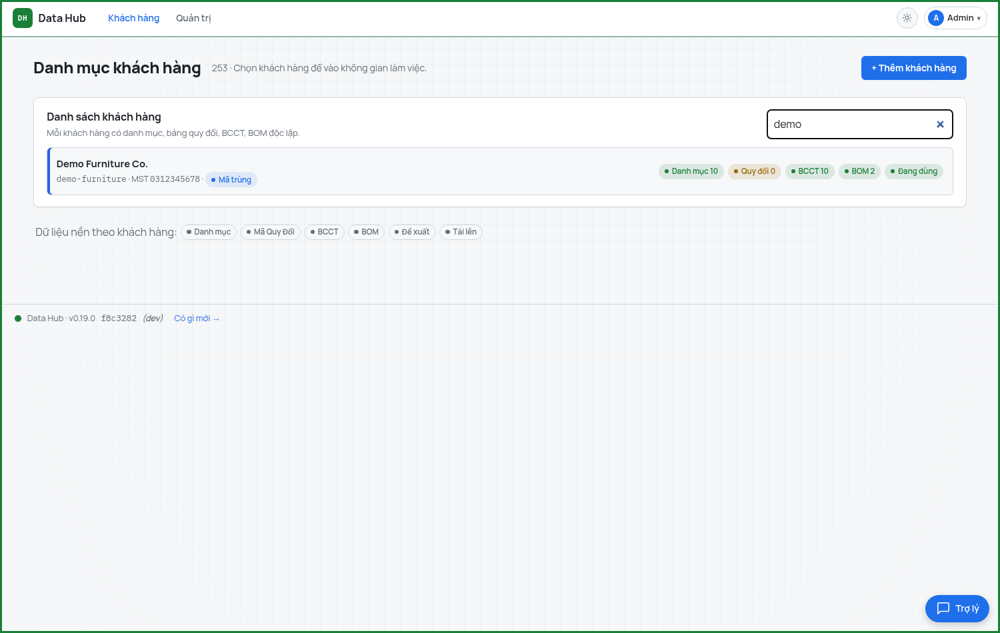

Các huy hiệu bên phải cho biết độ "đầy đủ" dữ liệu của công ty: **Danh mục 10 · Quy đổi 0 · BCCT 10 · BOM 2 · Đang dùng**.

### 2.2. Tổng quan công ty

Bấm vào công ty để vào không gian làm việc. Thanh tab: **Tổng quan · Danh mục · Hải quan · Quyết toán · BOM · Tải lên · Trợ lý · Cấu hình**.

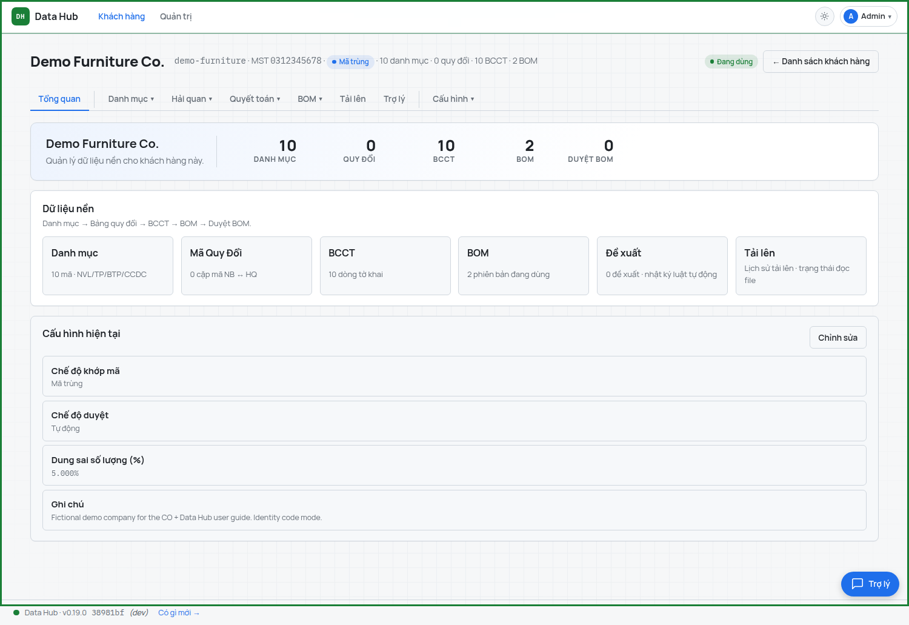

### 2.3. Danh mục NVL / SP

Tab **Danh mục** liệt kê toàn bộ Nguyên vật liệu (NVL) và Thành phẩm (SP/TP) kèm mã hải quan, đơn vị tính, mã HS, trạng thái. Đây là dữ liệu CO dùng để hiển thị tên và phân loại vật tư trên bảng kê.

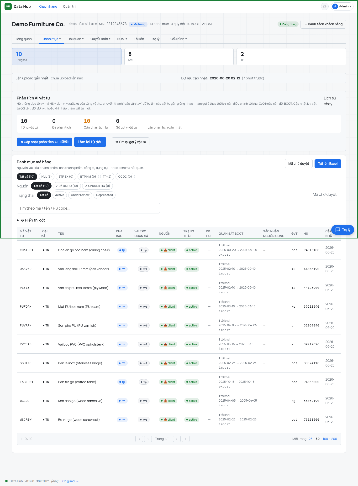

> Khối "Phân tích AI vật tư" thống kê độ phủ phân loại declarability (`customs_relevance`). Vật tư chưa phân loại sẽ **được giữ lại** trên bảng kê (không tự loại) — xem mục 5 (Lưu ý vận hành).

### 2.4. Tờ khai hải quan (BCCT)

Tab **Hải quan → BCCT** là dữ liệu tờ khai: cả **nhập khẩu (NK)** và **xuất khẩu (XK)**, kèm số tờ khai, ngày, mã loại hình (E11 nhập, E42 xuất), tên hàng, số lượng, trị giá.

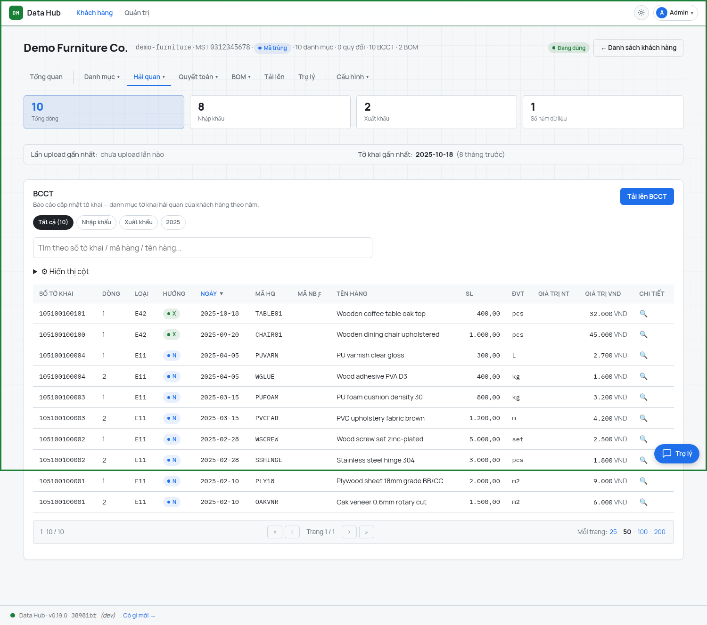

Ý nghĩa với CO:
- **Tờ khai NHẬP (E11)** → nguồn **tồn CO** (số lượng NVL còn lại để trừ lùi) và **đơn giá** NVL không xuất xứ (dùng tính LVC).
- **Tờ khai XUẤT (E42)** → xác định **sản phẩm nào** được khai trong hồ sơ C/O.

### 2.5. Định mức sản phẩm (BOM)

Tab **BOM** liệt kê các bản lưu định mức của từng sản phẩm. Mỗi bản lưu là **bất biến, chỉ thêm** (không sửa đè) để truy vết.

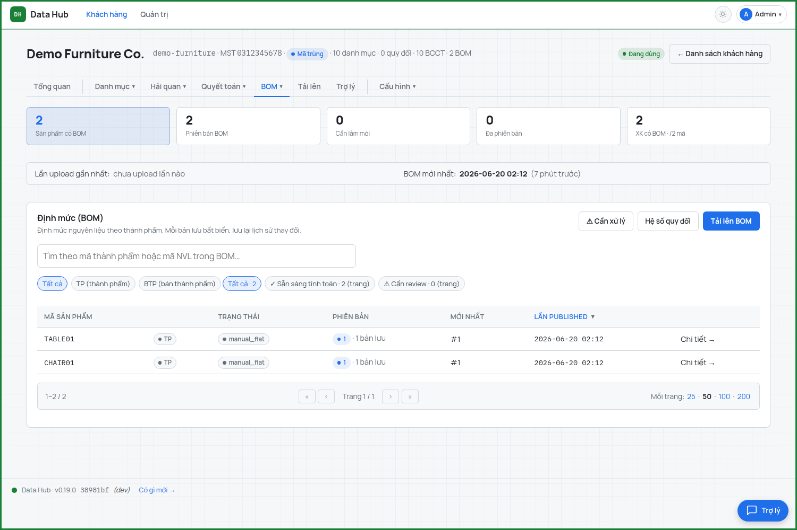

Bấm vào một sản phẩm để xem các bản lưu của nó (shape, người tạo, intent, số dòng, hash, trạng thái):

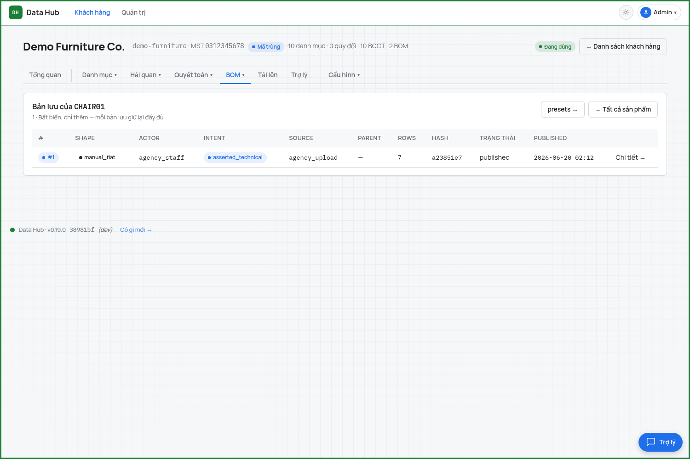

Bấm **Chi tiết →** để xem định mức từng dòng NVL (Mã NVL · Định mức · ĐVT):

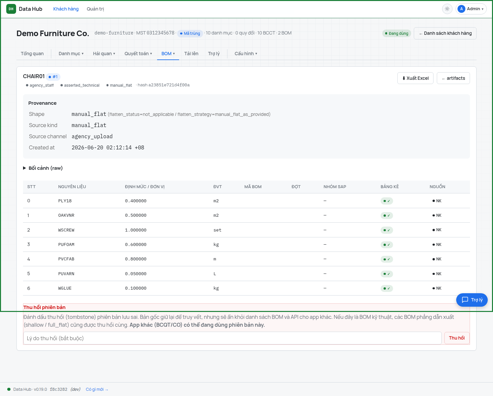

> CO chỉ chọn được các BOM dạng **flat đầy đủ** (`manual_flat` / đã nổ hết NVL). BOM "nông" (dừng ở bán thành phẩm) không dùng để tính C/O.

### 2.6. Đề xuất BOM (proposals)

Khi nhân viên CO sửa/đề xuất BOM mới cho một hồ sơ, đề xuất hiện ở tab **Quyết toán → Đề xuất** để người có quyền duyệt.

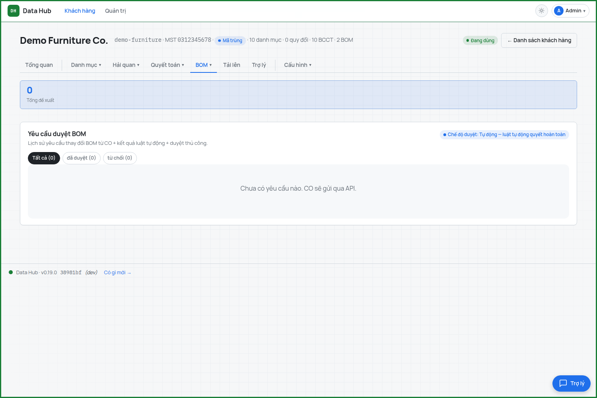

---

## 3. Phần B — CO: lập hồ sơ C/O theo 5 bước

### 3.0. Vào CO & chọn công ty

Mở CO tại **`https://barry-co.tinsu.ai`**. Trang **Công ty** liệt kê các công ty (đọc trực tiếp từ Data Hub — công ty mới thêm bên Data Hub sẽ tự xuất hiện ở đây).

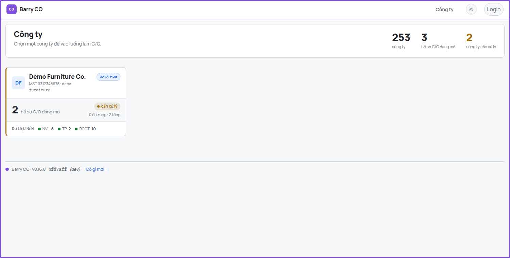

### 3.0b. Chuẩn bị tồn CO (làm 1 lần cho công ty mới)

Lần đầu với một công ty, vào tab **Tồn CO** và bấm **Refresh từ Data Hub** để **vật chất hoá (materialize)** tồn từ tờ khai nhập BCCT. Đây là điều kiện để bảng kê có **đơn giá** và **số lượng tồn** để trừ lùi.

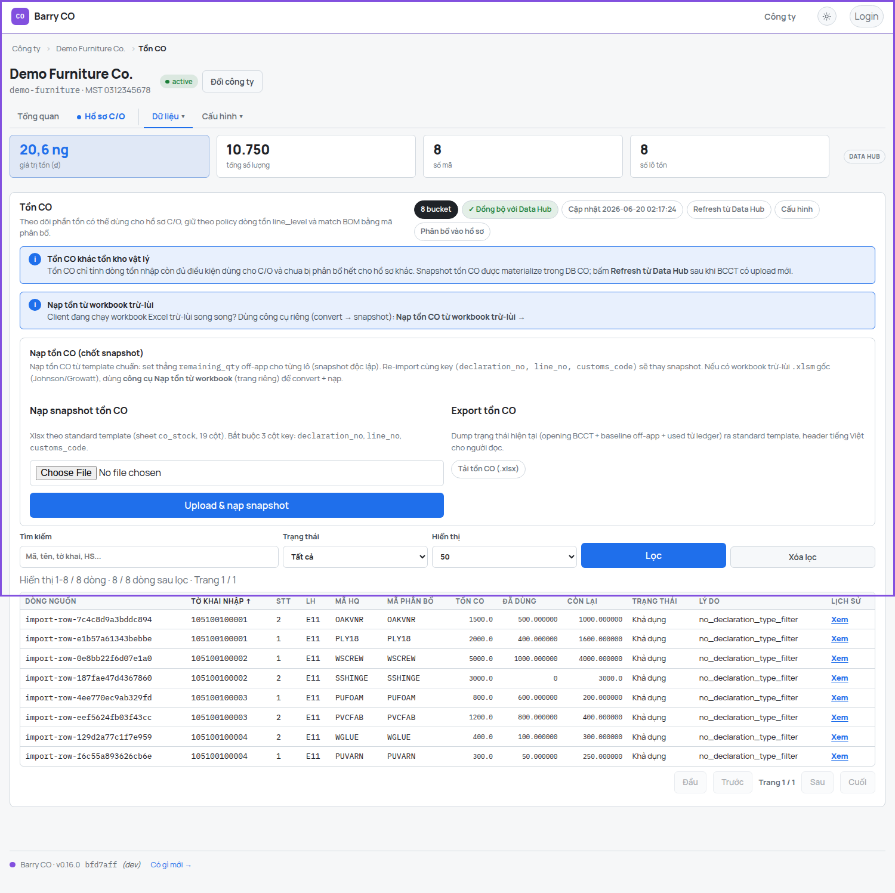

> Sau khi refresh, bảng tồn hiển thị từng lô NK (số tờ khai · mã NVL · số lượng · còn lại). Tồn được lưu phía CO và **chỉ cần refresh lại khi Data Hub có tờ khai mới**.

### 3.1. Tạo hồ sơ

Vào tab **Hồ sơ C/O** → danh sách hồ sơ của công ty.

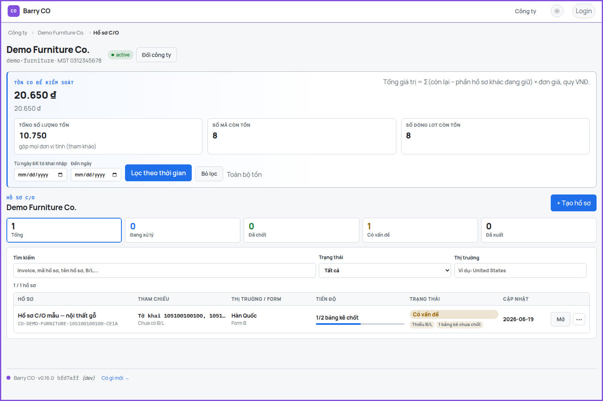

Bấm **+ Tạo hồ sơ** → điền:
- **Thị trường** (vd "Hàn Quốc") — quyết định form C/O được gợi ý.
- **Số tờ khai xuất** (vd `105100100100, 105100100101`) — hệ thống lấy đúng các **sản phẩm** trong những tờ khai này làm sheet bảng kê.
- **Tên hồ sơ** (tuỳ chọn).

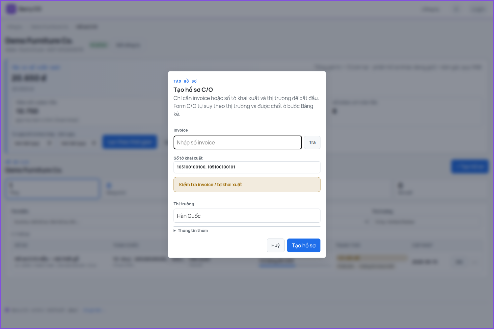

### 3.2. Bước 1 — Lô hàng

Sau khi tạo, hệ thống vào **Bước 1 · Lô hàng**. Thanh tiến trình 5 bước ở trên cùng cho biết trạng thái từng bước. Ở đây có thể bổ sung số invoice, số B/L, kiểm tra tờ khai xuất và thị trường.

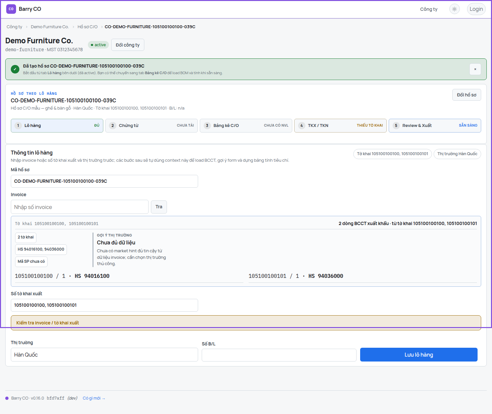

> Ghi chú: nhập **số tờ khai xuất** hoặc **invoice** là đủ để hệ thống tự nạp ngữ cảnh BCCT và gợi ý form.

### 3.3. Bước 2 — Chứng từ

**Bước 2 · Chứng từ**: kéo-thả tải lên bộ chứng từ (Invoice, Bill of Lading, Packing List, và chứng từ bổ sung). Có thanh tiến độ "bắt buộc N/3".

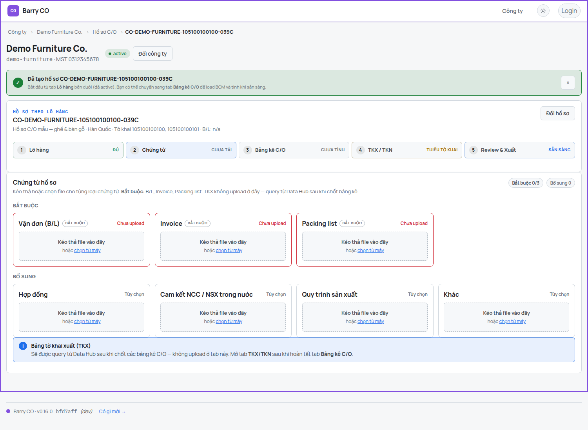

### 3.4. Bước 3 — Bảng kê C/O (quan trọng nhất)

Đây là bước nghiệp vụ cốt lõi: tính tỷ lệ hàm lượng giá trị khu vực (**LVC/RVC**) cho từng sản phẩm.

**a) Danh sách sheet sản phẩm.** Mỗi sản phẩm trong tờ khai xuất là một "sheet". Bảng tổng cho biết trạng thái, BOM, cấu hình form và số liệu.

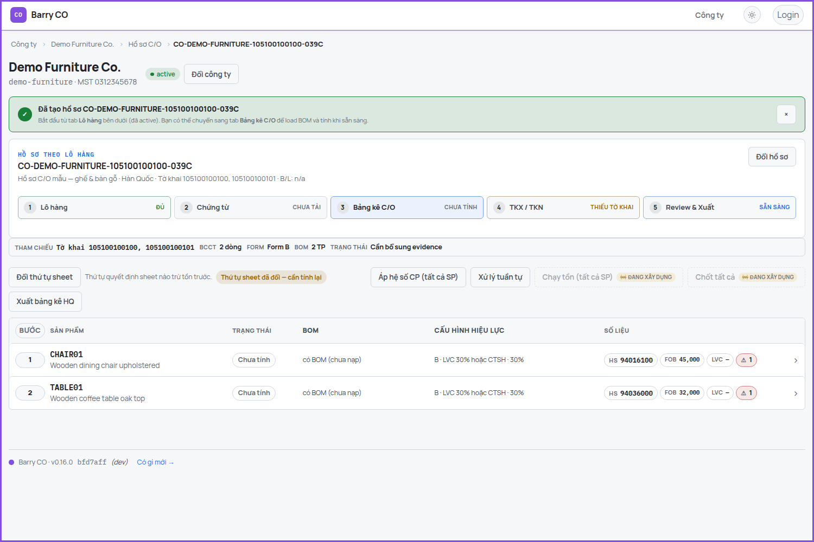

**b) Load BOM.** Mở một sheet, bấm **Load BOM** để nạp cấu trúc định mức (NVL) từ Data Hub vào bảng kê.

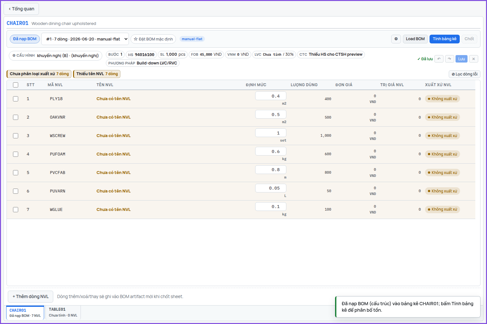

**c) Tính bảng kê.** Bấm **Tính bảng kê** — hệ thống phân bổ tồn CO, lấy đơn giá NVL không xuất xứ, và tính **LVC**. Thanh cấu hình hiển thị: HS, FOB, VNM (trị giá NVL không xuất xứ), **LVC % / ngưỡng**, kết quả CTC.

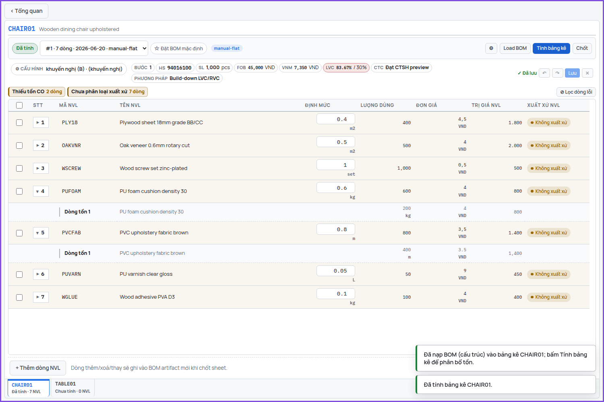

Trong ví dụ: CHAIR01 đạt **LVC 83.67% / ngưỡng 30%** → đạt tiêu chí. Bảng liệt kê từng NVL với định mức, lượng dùng, đơn giá, trị giá và nhãn xuất xứ ("Không xuất xứ" = tính vào VNM).

**d) NVL thay thế (khi thiếu tồn).** Nếu một NVL thiếu tồn, bấm tìm NVL thay thế. Modal gợi ý ứng viên (ưu tiên đơn giá thấp để tăng LVC). Nếu Data Hub chưa có gợi ý precomputed, CO **tự dò heuristic theo mã HS** (không phụ thuộc Data Hub).

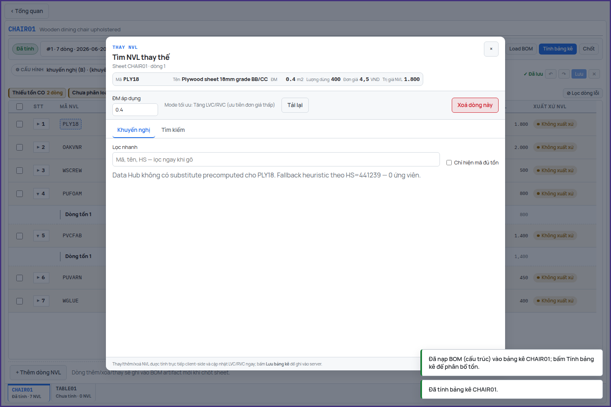

> **Tính năng mới (v0.16.0): ưu tiên lịch sử thay thế.** Những mã đã từng được dùng để thay NVL này trong các hồ sơ **đã chốt** trước đó sẽ được **ghim lên đầu** danh sách kèm huy hiệu `↺ đã từng thay ·N`. Huy hiệu xuất hiện sau lần thay-và-chốt đầu tiên.

**e) Chốt sheet.** Khi sheet đạt và đủ đơn giá, bấm **Chốt** để khoá. Sheet đã chốt hiển thị 🔒 và trừ tồn CO (ghi claim). Có thể **Mở chốt** để sửa lại.

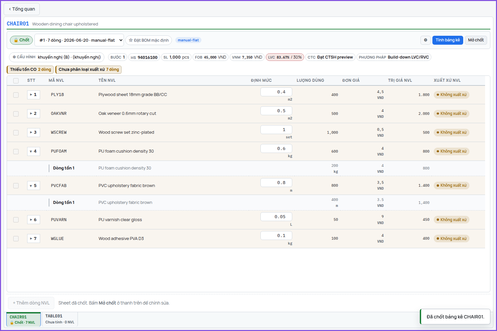

Bảng tổng bước 3 cho thấy tiến độ chốt (vd **1/2 chốt**): một sheet 🔒 Chốt, một sheet đang làm.

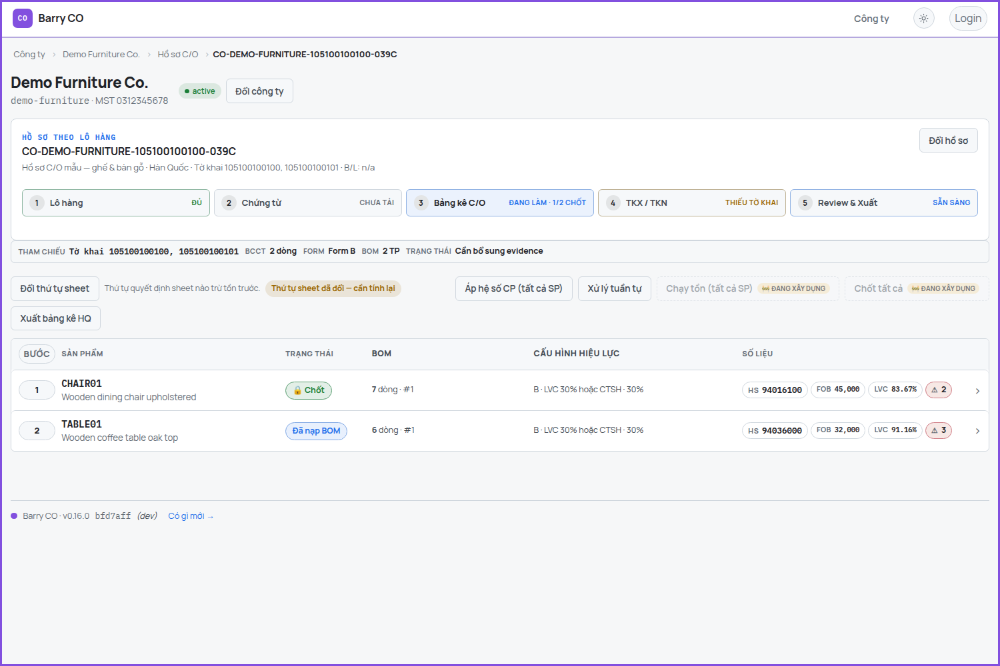

### 3.5. Bước 4 — TKX / TKN

**Bước 4** đính kèm file tờ khai xuất (TKX) và tờ khai nhập (TKN) tương ứng với các lô đã dùng, để hoàn thiện bộ chứng từ.

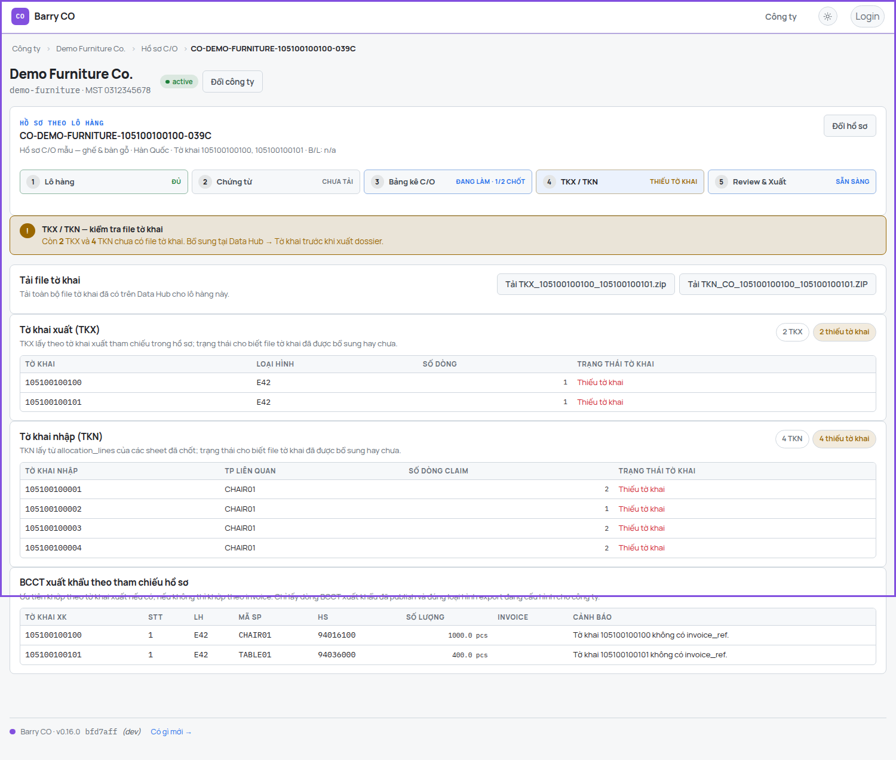

### 3.6. Bước 5 — Review & Xuất

Khi các sheet đã chốt, bước 5 sẵn sàng. Dùng **Xuất bảng kê HQ** (nút trên bảng tổng bước 3) để xuất bảng kê theo mẫu hải quan, hoặc xuất cả bộ hồ sơ (dossier .zip).

---

## 4. Tính năng mới nhất (v0.16.0)

| Tính năng | Mô tả | Lợi ích |
|---|---|---|
| **Ưu tiên lịch sử thay thế NVL** | Mã từng dùng thay cho một NVL trong hồ sơ đã chốt được ghim lên đầu, xếp theo số lần dùng (`↺ đã từng thay ·N`). Mined từ chính dữ liệu CO, **không phụ thuộc Data Hub**. | Tái dùng quyết định đã được kiểm chứng, nhất quán giữa các hồ sơ |
| **Xử lý lỗi nhẹ nhàng** | Lỗi điều hướng trên trình duyệt hiển thị trang lỗi có định dạng (không còn JSON thô). Form xuất bảng kê HQ submit qua fetch → tải về khi thành công, báo lỗi tại chỗ khi thất bại. | Trải nghiệm rõ ràng, không "đứng hình" |
| **Toast lỗi toàn cục** | Mọi lệnh fetch lỗi tự hiện thông báo (toast) với nội dung lỗi từ server; toast gộp trùng. | Không còn lỗi AJAX bị "nuốt" âm thầm |

---

## 5. Lưu ý vận hành & xử lý sự cố

- **Công ty mới phải refresh tồn CO 1 lần** (mục 3.0b) trước khi Tính bảng kê — nếu không, NVL sẽ **thiếu đơn giá** và **không chốt được**.
- **Chốt theo thứ tự:** các sheet được chốt tuần tự (sheet sau đòi sheet trước đã chốt). Đây là thiết kế để trừ tồn nhất quán.
- **"Thiếu đơn giá" → không chốt:** nếu một NVL không có đơn giá (chưa khớp tồn/tờ khai nhập), hệ thống chặn Chốt để tránh phát hành C/O sai LVC. Bổ sung đơn giá / khớp tồn rồi Tính lại.
- **Vật tư chưa phân loại declarability** (`customs_relevance` rỗng) được **giữ lại** trên bảng kê (không tự loại rác). Việc phân loại là phía Data Hub.
- **CO không sửa dữ liệu nền:** muốn thêm/sửa danh mục, BOM, tờ khai → làm bên **Data Hub**, CO sẽ đọc lại.
